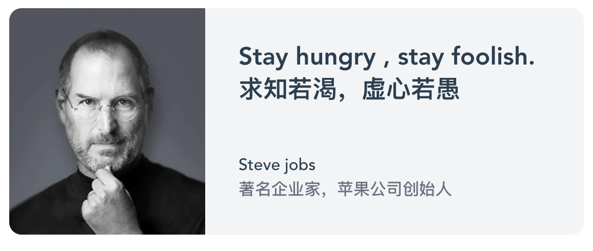

# 软件工程师面试题

我们正在招聘初中级软件工程师，欢迎参加我们的工程师面试。 由于疫情及各种原因，我们设计了一套试题，允许您在家远程完成。

目前设计了若干编程题，主要涉及前端的知识与技能。您根据自己情况，可以全部完成，也可以完成其中之一，也可以完成大部分功能。完成之后请向 srdrm[at]icloud.com 发送邮件或通过相关HR或招聘渠道联系我们。
我们会有专人跟进招聘流程。

## 如何提交作答

请克隆这个仓库，并在克隆后的仓库上作答，作答完成把您的仓库地址发送到 srdrm[at]icloud.co，或在联系相关HR

## 问题1、实现一个简单的响应式卡片

请使用 HTML/CSS 实现如下效果，注意这个页面在不同屏幕尺寸时，有不同布局。

### 宽屏效果



### 窄屏效果


### 视频效果

<div>
    <video src="./problem-1/example-video.mp4" width="560" />
</div>

如无法播放点击这里: [观看视频](./problem-1/example-video.mp4)

1. 图片素材已准备好，在 `problem-1` 目录中
2. 关于宽屏/窄屏的尺寸大小
    - 宽屏 ( `> 1024px` )
    - 窄屏 ( `<= 1024px` )

## 问题2、使用 Vue 实现一个表单编辑界面

### 基本需求

开发一个【组织管理】的表单页面（界面效果见：[查看 UI 原型图](./problem-2/wire-frames.png)），
这个界面用于管理组织/机构，及其下的成员信息。数据信息以 JSON 形式提供。

### 技术需求

#### 必需

- 使用 Vue 3
- 使用 Typescript

#### 可选

- 如果需要可以使用一个 CSS 库 （首选 [tailwindcss](https://tailwindcss.com)）

### 功能需求

#### Spec 1

1. 用户可以修改组织详情（名称）
2. 用户可以移动组织到另一个组织下
3. 用户可以创建组织

#### Spec 2

4. 用户可以修改组织中的成员信息（名称、年龄、状态）
5. 用户可以移动成员到另一个组织下
6. 用户可以创建成员
7. 用户可以将成员设置为管理员，当成员为激活状态时

#### 注意：

- 如果输入无效，请给予适当提示
- 用户可以取消当前修改，在保存之前
- 用户提交请求时，处理相关的响应信息
- 可以使用任意第三方库

请在你的作答仓库中添加 srdrm@icloud.com 作为仓库协作者。

## 问题3、实现后端 HTTP 接口

> 见目录 [`problem-3`](./problem-3)
> 实现后端 HTTP 接口，接口以 HTTP 协仪提供，数据传输格式为 JSON。


请使用 Node.js 及或任一 Web 框架 (koa/express/fastify) 实现

### 注册账户接口

实现用户账户注册，此接口向系统登记合法的用户名/密码，一旦登记成功，则可以使用已注册的用户名/密码登录。

注册失败时，应将失败信息返回给接口调用者，以下情形之一会发生失败：

1. 用户名已存在
2. 用户名或密码不符合规范

| 用户名规范                                                                       | 密码规范                                                |
|:----------------------------------------------------------------------------|:----------------------------------------------------|
| <ol><li>长度在 5 - 20 之间</li><li>必须由小写英文字母，数字，及下划线组成</li><li>不能以数字开头</li></ol> | <ol><li>长度须 6 位以上</li><li>须包含大写，小写，数字至少二项</li></ol> |

**HTTP 方法/URL：**

POST /accounts/signup

**请求体：**

```json
{
  "username": "username",
  "password": "password"
}
```

**响应：**

无论是否注册成功，HTTP 状态码均为 200 OK，若其他状态，则表示服务器异常。

**响应体**

成功时，返回格式：

```json
{
  "ok": true,
  "status": 200
}
```

失败，用户名已存在，应返回：

```json
{
  "ok": false,
  "status": 500,
  "msg": "用户名已存在"
}
```

失败，用户名或密码不符合规范时， **status** 返回 401，**msg** 字段应返回详细的不规范信息

```json
{
  "ok": false,
  "status": 401,
  "msg": "用户名不规范，长度应在 5 - 20 之间"
}
```

### 登录接口

接受用户名/密码，如与数据库中已匹配的，则返回成功，并创建会话设置 cookie，否则提示用户名或密码不正确


